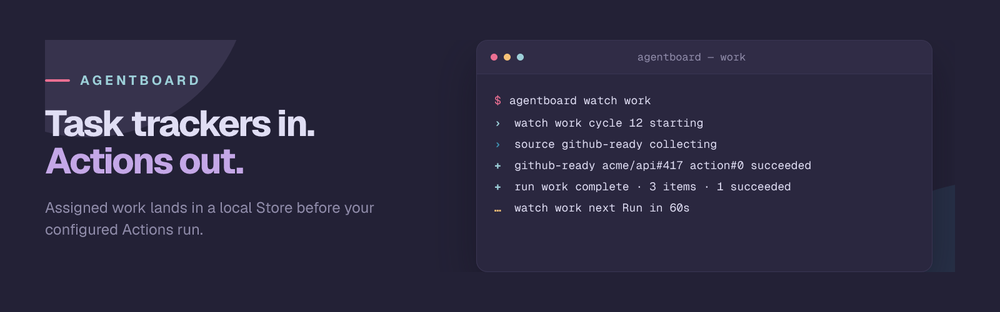

# AgentBoard

AgentBoard is a Bun CLI for collecting work from GitHub Issues, Jira Cloud, or QMD collections, then running Actions for each matching Item.

Define a Workspace that selects only the work you care about—for example, open GitHub Issues assigned to you with a `ready-for-agent` label. AgentBoard stores local copies, then runs the Actions you configured. The built-in Actions create Git worktrees and run shell commands.

AgentBoard provides the queue and action pipeline. It does not include an agent runtime.

```text
Sources -> local Store -> configured Actions
```

## Install

AgentBoard publishes platform archives in component releases named `agentboard-v<VERSION>`.

### ubi

Install a pinned release and select the `agentboard` executable from its archive:

```bash
ubi --project zenobi-us/agentboard \
  --tag agentboard-v0.1.0-next.53.1 \
  --exe agentboard
```

See [ubi installation](https://github.com/houseabsolute/ubi#quick-start) if `ubi` is not installed.

### mise

Add the GitHub backend to `mise.toml`. The version prefix prevents `latest` from selecting releases for other components in this repository.

```toml
[tools]
"github:zenobi-us/agentboard" = { version = "latest", version_prefix = "agentboard-v" }
```

Then install it:

```bash
mise install
```

## GitHub Issues quickstart

Authenticate GitHub CLI first. AgentBoard uses it as a credential helper:

```bash
gh auth login
agentboard workspace init ./work.toml
agentboard workspace edit ./work.toml # opens $EDITOR
```

Configure the Workspace:

```toml
[[sources]]
id = "github-assigned"

[sources.source]
uses = "@agentboard/source-github"
mode = "issue"
query = "repo:OWNER/REPO is:open assignee:@me label:ready-for-agent"
limit = 50
status_map = { ready-for-agent = "ready" }

[sources.source.credentials]
helper = "gh auth token"

[[sources.actions]]
uses = "@agentboard/action-run-cmd"

[sources.actions.with]
cmd = "echo 'launch your agent for {{ item.url }}'"
```

Replace `OWNER/REPO` with the repository to watch. The example Action is deliberately harmless: replace the `echo` command with your agent launcher when the dry run shows the expected Issues. AgentBoard runs that command through `sh -c` for each matching Item.

```bash
agentboard doctor work
agentboard run work --dry-run
agentboard run work --watch --interval 60s
```

A dry run collects and renders pending Actions without executing them or writing to the Store. `run --watch` repeats the Run until you stop it with Ctrl-C.

## How AgentBoard fits together

- **Workspace** — TOML file containing Sources and their Actions.
- **Source** — GitHub Issues, Jira Cloud, or QMD collections selected by a query.
- **Item** — normalized local copy of one task-like record, including its raw source payload.
- **Store** — local append-only JSONL history of Item observations and Action attempts.
- **Action** — configured side effect, currently a shell command or Git worktree creation.
- **Run** — one pass that collects Items, updates the Store, and executes pending Actions.
- **Watch Mode** — repeated Runs for one Workspace.

The upstream tracker remains the source of truth. Successful Actions are recorded locally and skipped on later Runs unless their rendered inputs change.

## Documentation

- [CLI commands](https://zenobi-us.github.io/agentboard/cli/commands)
- [Workspaces and schema](https://zenobi-us.github.io/agentboard/cli/workspaces)
- [Sources](https://zenobi-us.github.io/agentboard/cli/sources), including [GitHub Issues](https://zenobi-us.github.io/agentboard/sources/github), [Jira Cloud](https://zenobi-us.github.io/agentboard/sources/jira), and [QMD](https://zenobi-us.github.io/agentboard/sources/qmd)
- [Actions](https://zenobi-us.github.io/agentboard/cli/actions), including [run command](https://zenobi-us.github.io/agentboard/actions/run-cmd) and [create worktree](https://zenobi-us.github.io/agentboard/actions/worktree)
- [Store layout and retry state](https://zenobi-us.github.io/agentboard/cli/store)
- [Contributing and development setup](./CONTRIBUTING.md)
